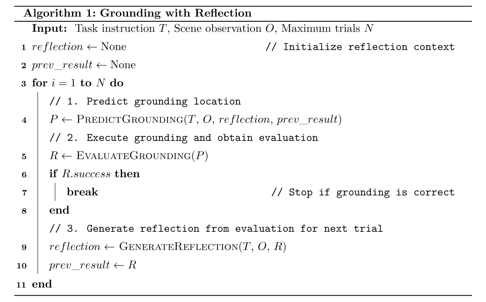
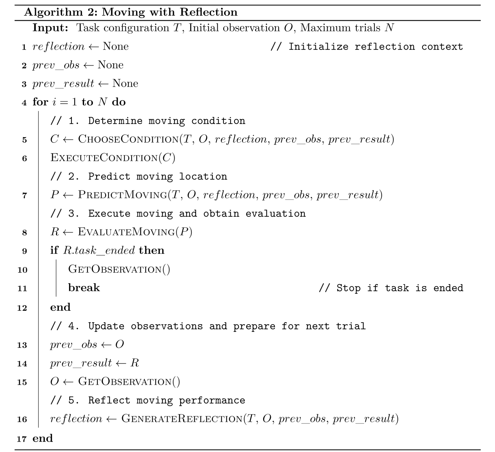

# Espire Evaluation

## 🚀 Quick Start
1. Install [uv](https://docs.astral.sh/uv/getting-started/installation/)
2. Setup:
    ```bash
    # Clone repository
    git clone -b <MODEL> https://github.com/spatigen/espire-eval.git

    cd espire-eval

    # Init and Sync
    uv init
    uv sync

    # Set your llm api key if not
    # export <MODEL>_API_KEY="YOUR_API_KEY"

    # Run
    uv run main.py
    ```
> Replace \<MODEL\> with one of the following options: `qwen`, `gemini`, `internvl`, `robobrain` (w/o api key)

---

## 🤖 Supported Model

| Model | Branch | URL |
|------|------|------|
| Qwen | `qwen` | https://github.com/spatigen/espire-eval/tree/qwen |
| Gemini | `gemini` | https://github.com/spatigen/espire-eval/tree/gemini |
| InternVL | `internvl` | https://github.com/spatigen/espire-eval/tree/internvl |
| Robobrain | `robobrain` | https://github.com/spatigen/espire-eval/tree/robobrain |

---

## 🧠 Pseudocode for Reflective Execution

### 🔎 Localization with Reflection


### 🧭 Execution with Reflection

